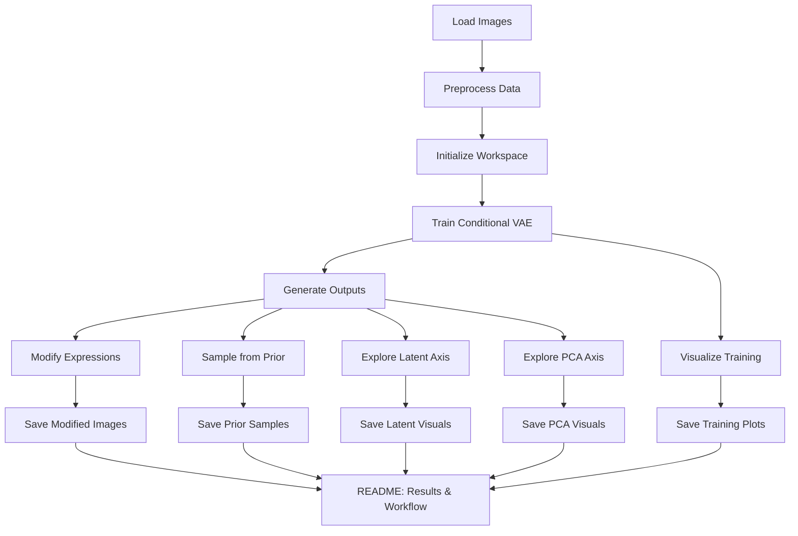

# EmotiVAE — Conditional Face Expression Generation

## About

Implementation of AE, VAE, and Conditional VAE (CVAE) in PyTorch. The CVAE is trained on faces from the [UTKFace Dataset](https://susanqq.github.io/UTKFace/) with a hand-crafted continuous encoding of expression intensity to enable conditional generation of synthetic faces at a desired expression level. The project provides both an RGB and a Grayscale pipeline.

**Key architectural choices:**
- **ELU** activations throughout (instead of LeakyReLU) for smoother gradient flow
- **Kaiming weight initialisation** for faster convergence
- **Dropout** in the encoder to improve generalisation
- **Cosine-annealing** learning-rate schedule

## Installation

1. Clone the repository:
   ```bash
   git clone https://github.com/<your-username>/EmotiVAE.git
   # EmotiVAE

   EmotiVAE is a Conditional Variational Autoencoder for facial expression generation and manipulation, built on the UTKFace dataset. The project includes custom architecture, data handling, and visualization scripts for exploring latent space and generating new faces.


## Actual Flow Diagram



   ## Workflow Steps

   1. Prepare the dataset (UTKFace images + smile encoding CSV)
   2. Initialize workspace directories
   3. Train the Conditional VAE model
   4. Generate outputs: modify expressions, sample from prior, explore latent/PCA axes
   5. Visualize training progress and latent variance
   6. Update README with results

   ## Usage

   ...existing code...
   ```bash
   python init_workspace.py
   ```

## Usage

### Automated pipeline (shell script)

```bash
sh execute_pipeline.sh
```

### Manual step-by-step

1. **Train** the model:
   ```bash
   python train_model.py --total_epochs=1000 --lr=0.00025 --kld_weight=0.5 \
                          --batch_count=8 --latent_dim=20 --img_size=50
   ```
2. **Generate synthetic faces** at a given expression level:
   ```bash
   python generate_from_prior.py --expression_level=0.6 --img_size=50 --latent_dim=20
   ```
3. **Shift expressions** in real images:
   ```bash
   python modify_expression.py --expression_level=0.6 --img_size=50 --latent_dim=20
   ```
4. **Explore latent dimensions**:
   ```bash
   python explore_latent_axis.py --axis=0 --img_size=50 --latent_dim=20
   ```
5. **Post-training analysis** (PCA, variance heatmaps, loss curves):
   ```bash
   python visualize_training.py --img_size=50 --latent_dim=20
   ```

## Project Structure

| File | Purpose |
|------|---------|
| `architectures.py` | Neural network definitions (`FaceEncoder`, `FaceDecoder`, `ConditionalVAE`, …) |
| `data_helpers.py` | `EmotionFaceDataset` loader and `compose_image_grid` utility |
| `monitoring.py` | `RunningVariance` (Welford's algorithm) and `LatentVisualizer` |
| `train_model.py` | Main training loop |
| `modify_expression.py` | Shift expression intensity in existing images |
| `generate_from_prior.py` | Sample synthetic faces from the prior |
| `explore_latent_axis.py` | Sweep a single latent dimension |
| `explore_pca_axis.py` | Sweep a PCA principal component |
| `visualize_training.py` | Loss curves, variance heatmaps, PCA analysis |
| `init_workspace.py` | One-time directory setup |
| `execute_pipeline.sh` | End-to-end automation script |

## The Dataset

Images come from the [UTKFace Dataset](https://susanqq.github.io/UTKFace/). Expression-intensity scores were produced by presenting each face in a rapid slideshow to multiple human raters, recording reaction times and binary smiley / non-smiley labels, and computing a continuous average encoding in the range **[-1, +1]**.

## References

- Kingma, D. P. & Welling, M. (2013). *Auto-Encoding Variational Bayes*. ICLR.
- Sohn, K., Yan, X., & Lee, H. *Learning Structured Output Representation using Deep Conditional Generative Models*.
- Fagertun, J. et al. (2013). *3D Gender Recognition Using Cognitive Modeling*. IWBF, IEEE.

## License

MIT — see [LICENSE](LICENSE).
